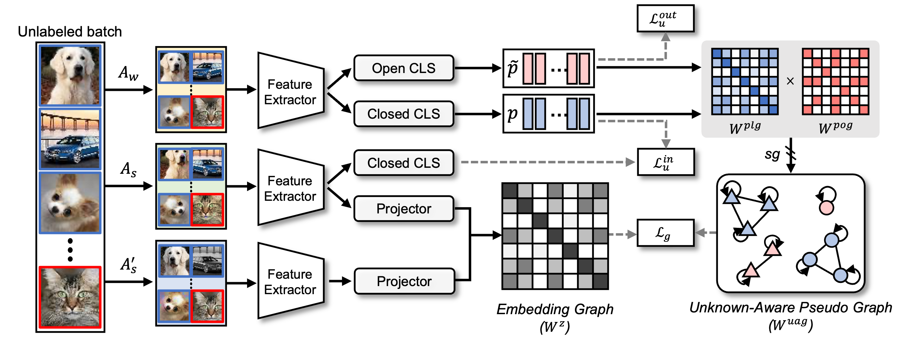

# Unknown-Aware Graph Regularization (UAGreg)

## Introduction

This is the official repository for our **AAAI 2024** paper:
> **Unknown-Aware Graph Regularization for Robust Semi-Supervised Learning from Uncurated Data**</br>
> Heejo Kong, Suneung Kim, Ho-Joong Kim, Seong-Whan Lee*</br>
[[`Paper`](https://ojs.aaai.org/index.php/AAAI/article/view/29227/30315)] [[`Poster`]](./assets/AAAI_2024_POSTER.pdf) [[`Slides`]](./assets/AAAI_2024_SLIDES.pdf) [[`BibTeX`](https://scholar.googleusercontent.com/scholar.bib?q=info:vRfe-ZmVU1UJ:scholar.google.com/&output=citation&scisdr=CgLmbaFnENyfiYj4JQA:AAZF9b8AAAAAaDf-PQBOezcpBr549yAJrwTGlyk&scisig=AAZF9b8AAAAAaDf-PVeRQ80oP0ctMbdVrxJBJco&scisf=4&ct=citation&cd=-1&hl=ko)]





## Usage

We implement UAGreg using the SSL and OSSL PyTorch benchmarks, [Pytorch-FixMatch](https://github.com/kekmodel/FixMatch-pytorch) and [OpenMatch](https://github.com/VisionLearningGroup/OP_Match).

### Dataset Preparation

All datasets are supposed to be under ./data (or create soft links) as follows.
```
├── UAGreg
    └── ...
├── data
    ├── cifar10
        └── cifar-10-batches-py
    └── cifar100
        └── cifar-100-python
    └── imagenet30
        └── one_class_test
        └── one_class_train
    └── ood_data
```

The data of ImageNet-30 can be downloaded in [OpenMatch](https://github.com/VisionLearningGroup/OP_Match).

The out-of-dataset testing data for extended open-set evaluation can be downloaded in [CSI](https://github.com/alinlab/CSI).


### Training

Training UAGreg on various datasets with different OSSL settings (correlated/uncorrelated outliers).

Run experiments on CIFAR-10:

```
sh run_cifar10_corr.sh (gpu_id) (num_labeled)
sh run_cifar10_uncorr.sh (gpu_id) (num_labeled)
```

Run experiments on CIFAR-100:

```
sh run_cifar100_corr.sh (gpu_id) (num_labeled)
sh run_cifar100_uncorr.sh (gpu_id) (num_labeled)
```

Run experiments on ImageNet-30:

```
sh run_imagenet.sh (gpu_id)
```


## Citations
```
@inproceedings{kong2024unknown,
  title={Unknown-aware graph regularization for robust semi-supervised learning from uncurated data},
  author={Kong, Heejo and Kim, Suneung and Kim, Ho-Joong and Lee, Seong-Whan},
  booktitle={Proceedings of the AAAI conference on artificial intelligence},
  volume={38},
  number={12},
  pages={13265--13273},
  year={2024}
}
```